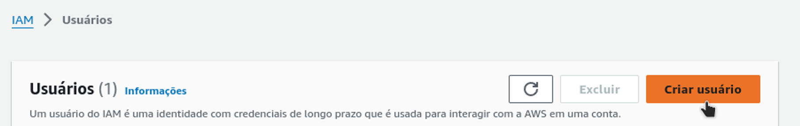
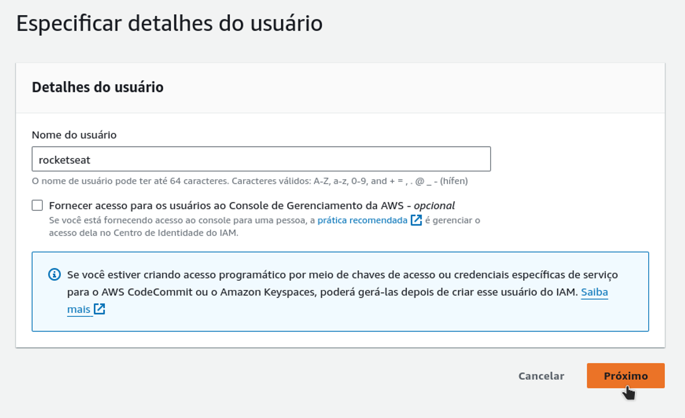
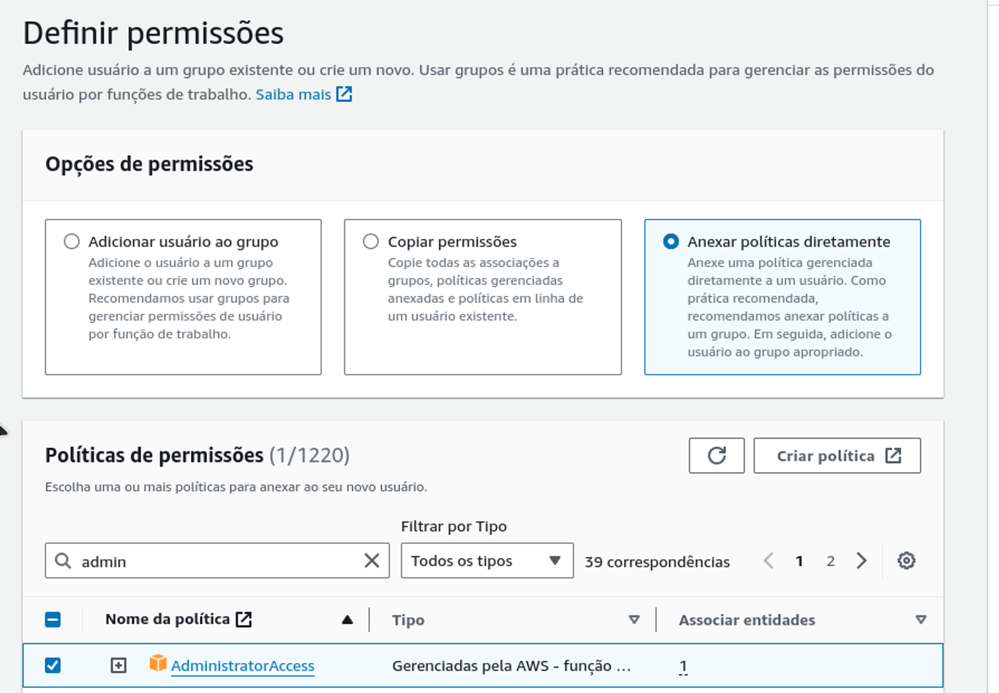
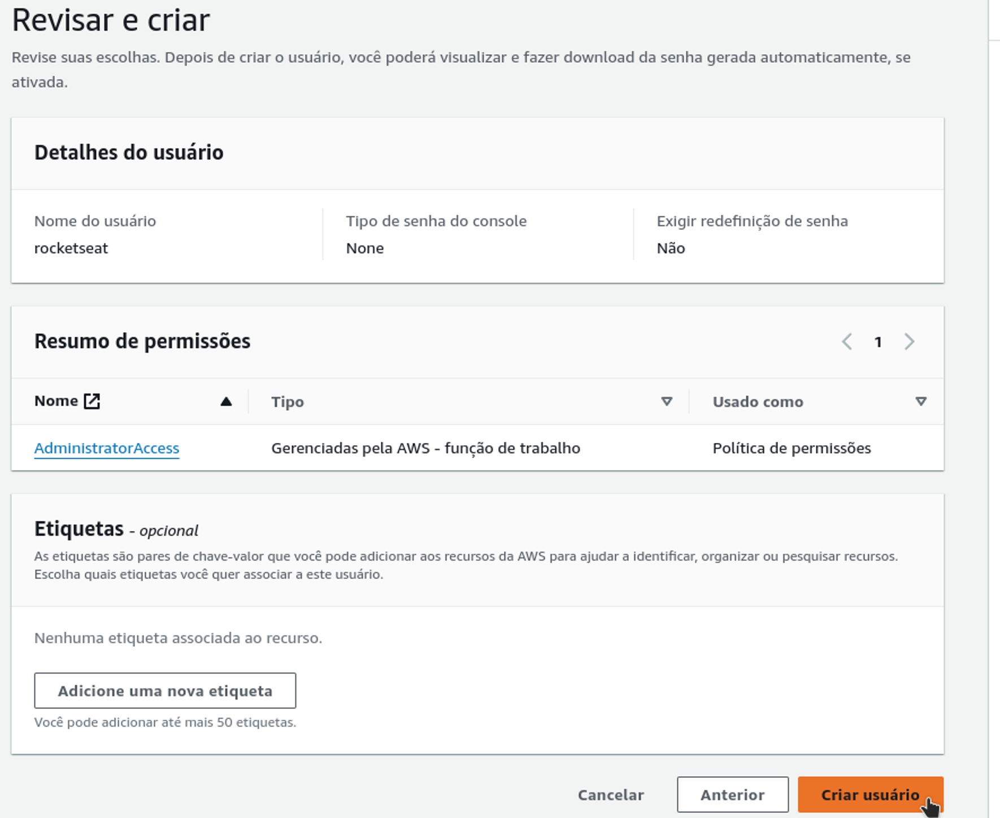
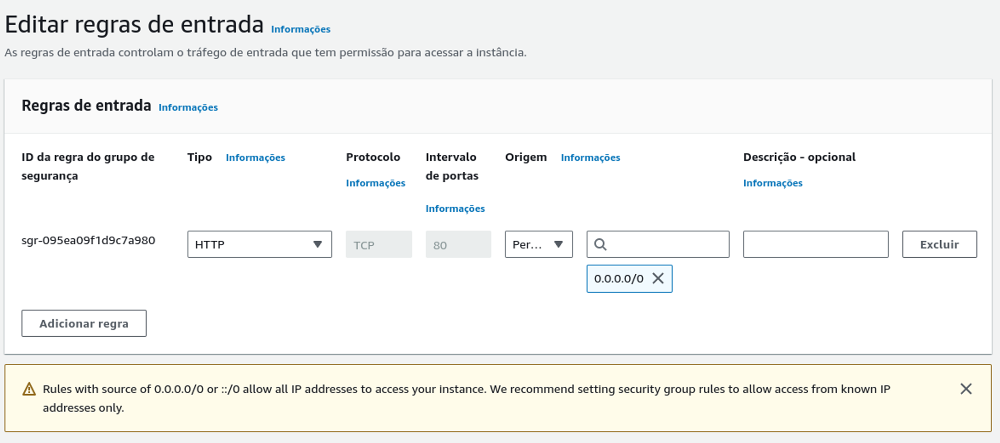
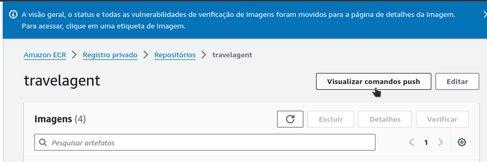
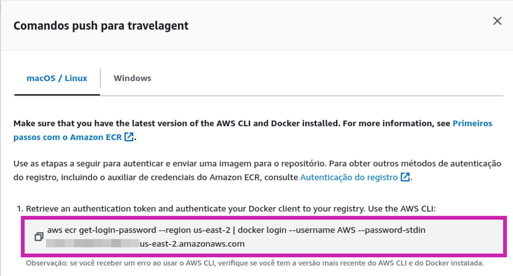

# Travel Agent AI

Este projeto é uma demonstração de como criar um agente de viagens automatizado utilizando LLM (Large Language Model) e Langchain. O agente é capaz de pesquisar informações na web, carregar documentos relevantes e fornecer roteiros de viagem detalhados. Este projeto faz parte de um evento da Rocketseat, na trilha de Inteligência Artificial (IA).

## Bibliotecas Instaladas

As seguintes bibliotecas são utilizadas no projeto:

- [Langchain](https://pypi.org/project/langchain/)
- [Langchain Community](https://pypi.org/project/langchain-community/)
- [Langchain OpenAI](https://pypi.org/project/langchain-openai/)
- [DuckDuckGo Search](https://pypi.org/project/duckduckgo-search/)
- [Wikipedia](https://pypi.org/project/wikipedia/)
- [Langchain Hub](https://pypi.org/project/langchainhub/)

## Configuração da AWS

### Criar um Usuário no IAM

Caso você não tenha um usuário criado no IAM, siga os passos abaixo para criar um com as permissões necessárias:

1. Acesse o IAM.
2. Clique na opção `Usuários` no menu lateral esquerdo.
3. Clique no botão `Criar usuário`.
   
4. Dê um nome ao usuário e clique em `Próximo`.
   
5. Selecione a opção `Anexar políticas diretamente` e marque `AdministratorAccess`. Clique em `Próximo`.
   
6. Revise as informações. Se tudo estiver correto, clique em `Criar usuário`.
   

### Editar Regras de Entrada

Caso as regras de entrada do grupo de segurança do `load balancer` não estejam configuradas corretamente (HTTP e `0.0.0.0/0`), você pode apagá-las e criar novas seguindo o padrão apresentado em aula:

### Erro no Docker Push - Credenciais Expiradas

Se você tentar fazer o `docker push` e receber um erro de credenciais expiradas, siga os passos abaixo para obter novas credenciais:

1. Acesse o ECR.
2. Acesse o seu repositório `travelagent`.
3. Clique no botão `Visualizar comandos push`.
   
4. Execute no terminal o comando de login no ECR.
   

## Executando o Projeto

### Pré-requisitos

- Python 3.7 ou superior
- Docker